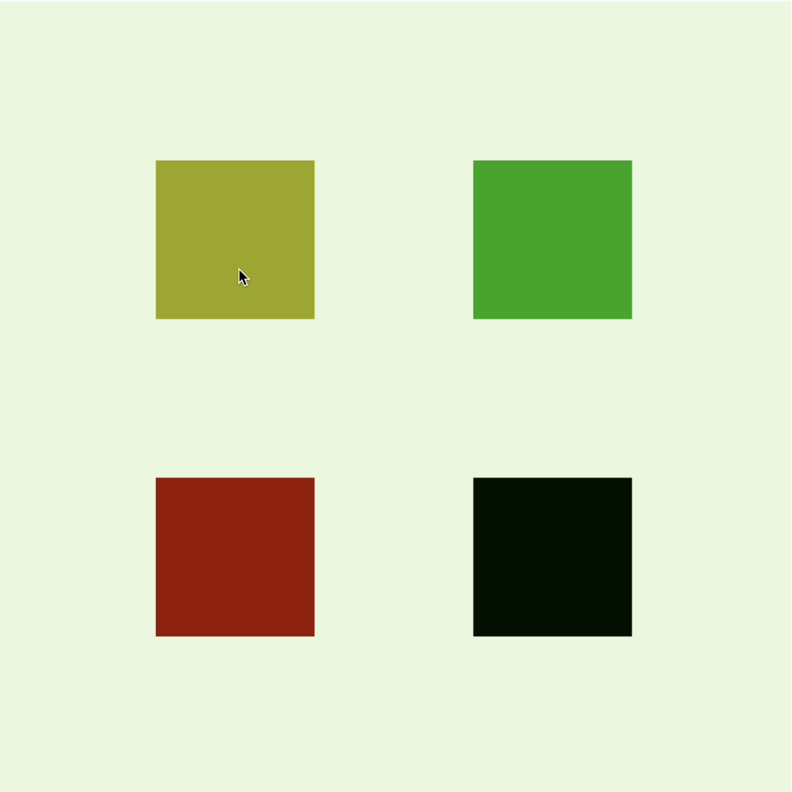
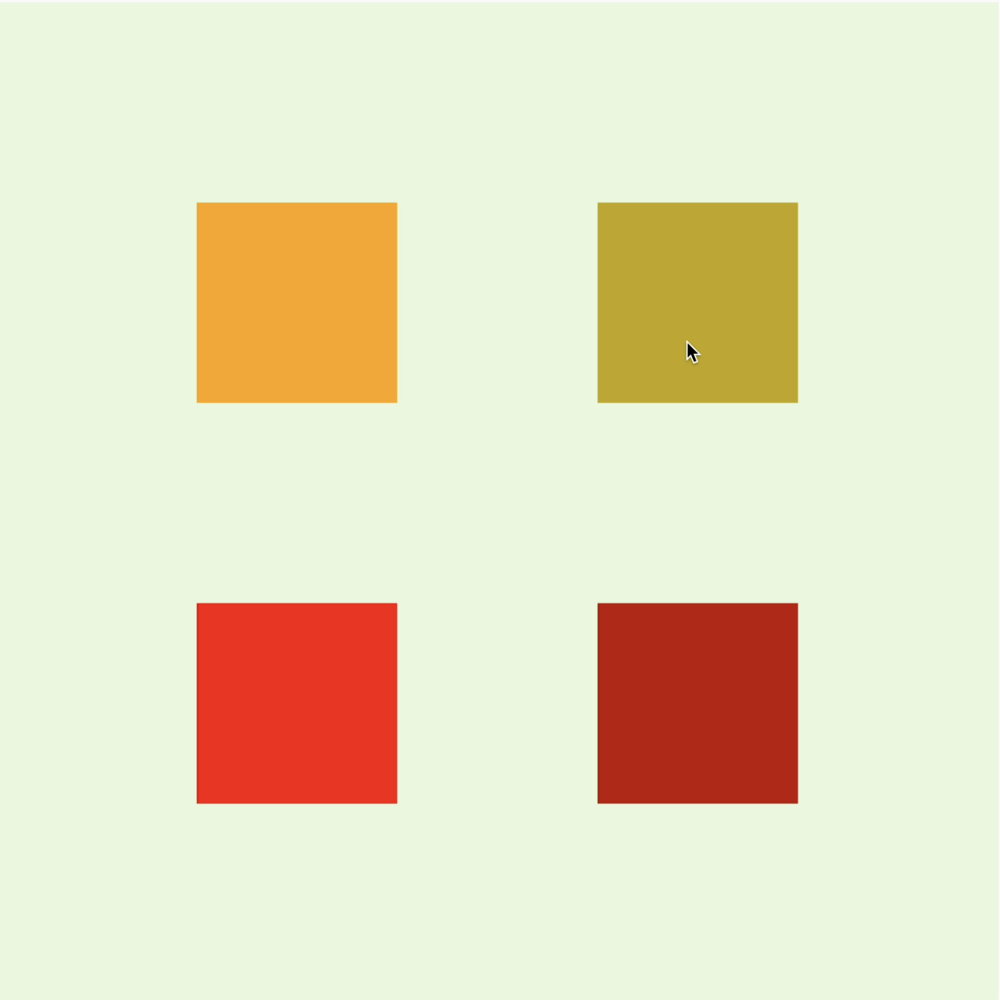
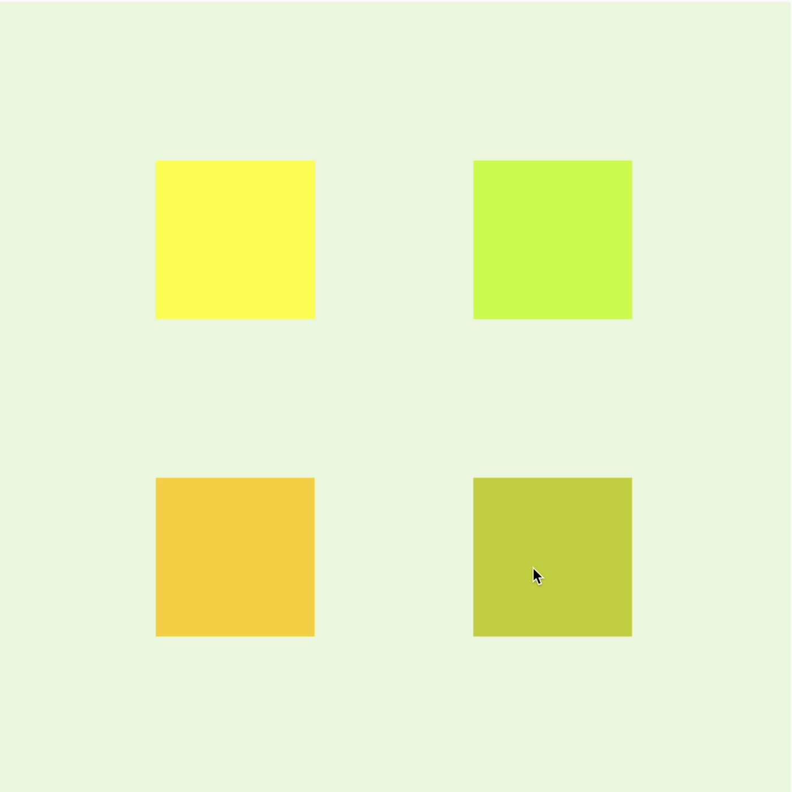
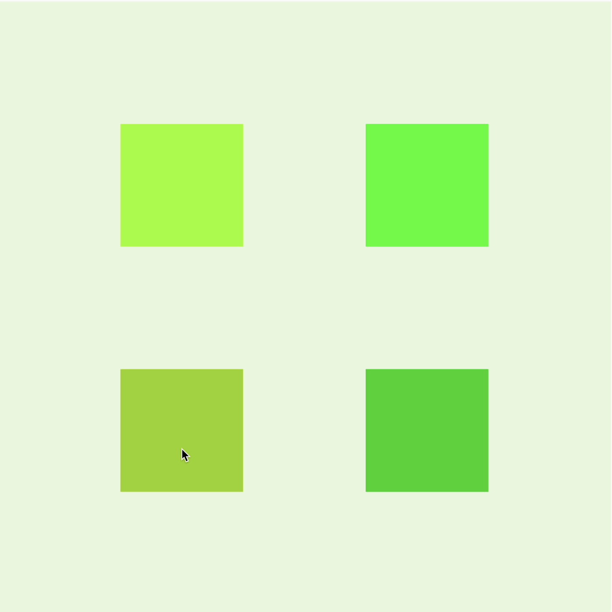
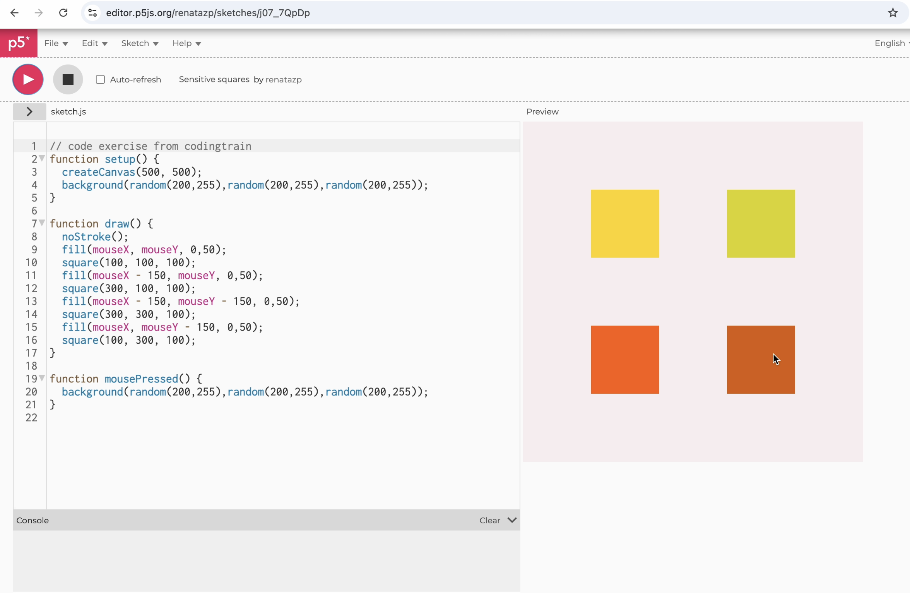

# twan0326_9103_tut6

This is my first local change to the repo.

# Week 8 Quiz_Tianshu Wang
## Part 1: Imaging Technique Inspiration
1. The imaging technique inspires me is *Sensitive squares* by Renata. 
2. I would like to incorporate the aspect of **Colours Variation Visual Outcome**, which is a helpful technique for three reasons:
- Firstly, this technique get user inputs to achieve the visual outcome. User input is one of the methods for Creative coding major project assignment's Individual Task.
- Secondly, Creative coding major project assignment is designed to examine what I have learnt across the semester, and user input is covered in Week 5 module.
- Thirdly, colours variation could bring creative outcomes.
3. Five Example Images
 

## Part 2: Coding Technique Exploration
1. [Link to the coding technique](https://editor.p5js.org/renatazp/sketches/j07_7QpDp)
2. This coding technique include the following to achieve the desired outcome in Part1.
- **Square Colour Variation**: The variables mouseX and mouseY follow the mouse position horizonally and vertically. By adding them in fill () in function draw(), squares colour variation happen following a mouse position change.
- **Background Colour Variation**: Each random () with two parameters return a random number from 200 to 255. By adding them in background() in function mousePressed(), background colour variation happens following a mouse button being pressed. 
3. same as above
4. Screenshot

[Link to the example implementation](https://editor.p5js.org/renatazp/sketches/j07_7QpDp)

> The end of the quiz content.